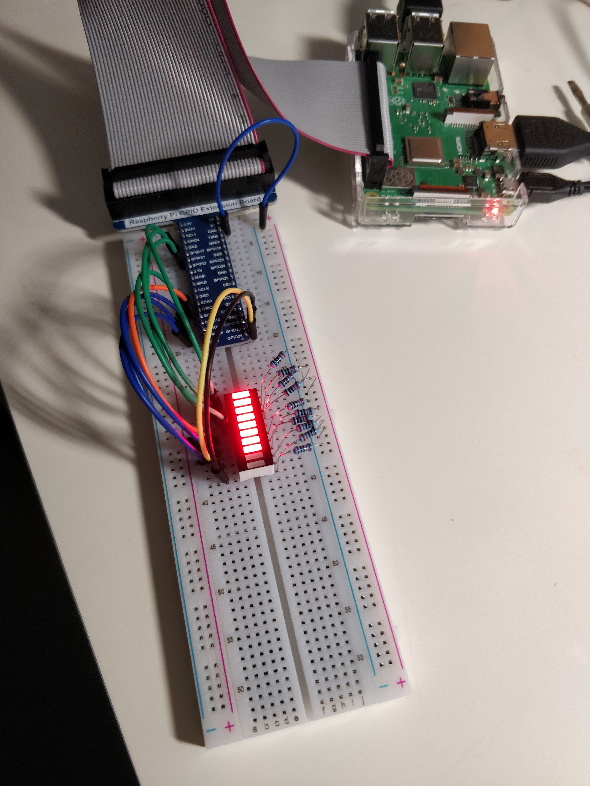
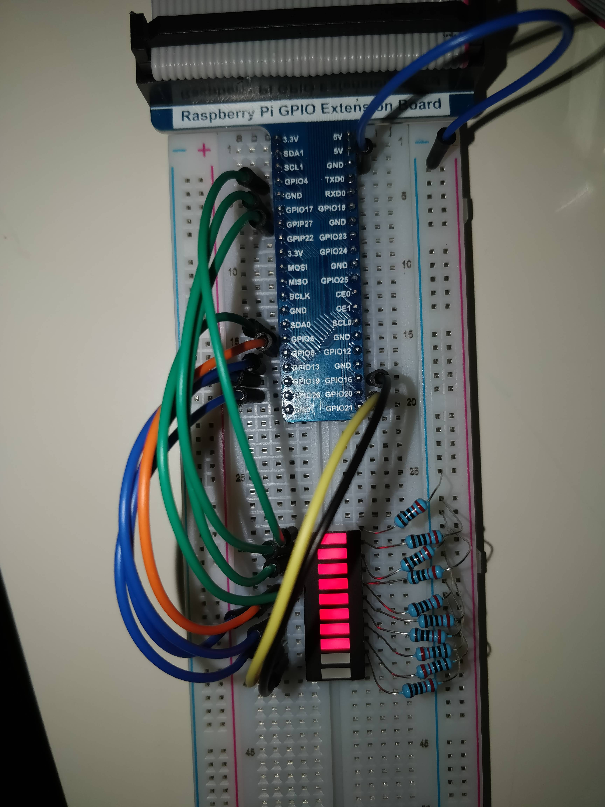
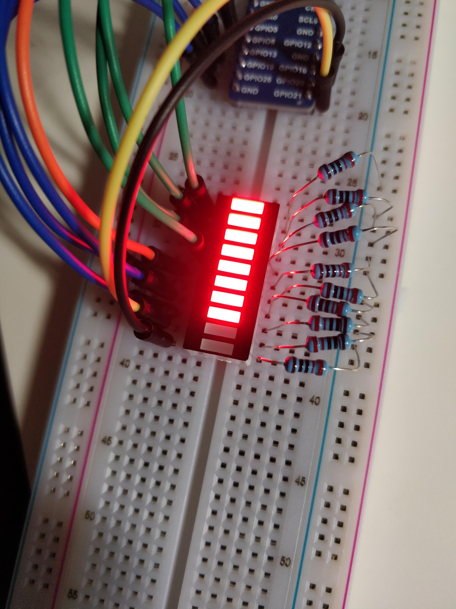

# Bouncing LED Ladder

This is my first "real" hardware project for the Pi.
It displays a bar that accends and then decends again.

## Important note

Don't use the "x" to close the program, as it will not release the pins for the OS.
Click the window itself to stop execution.

## Assembly

It uses the following GPIO Pins in this Order:  
4, 17, 27, 5, 6, 13, 19, 26, 21, 16  

The pins can be modified in the setup function

Each circut has a 220 Ohm resister that connects to ground.  

